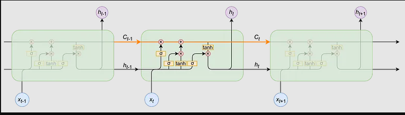
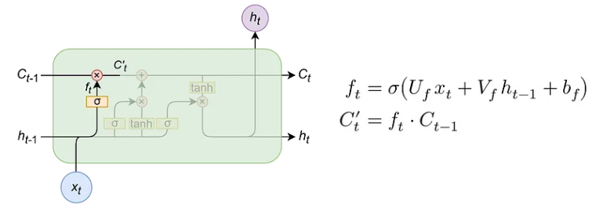
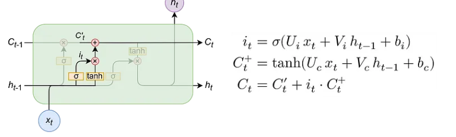
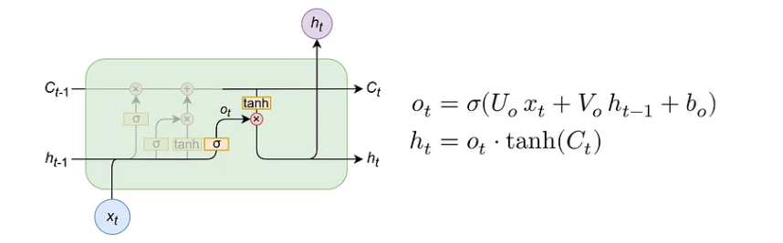
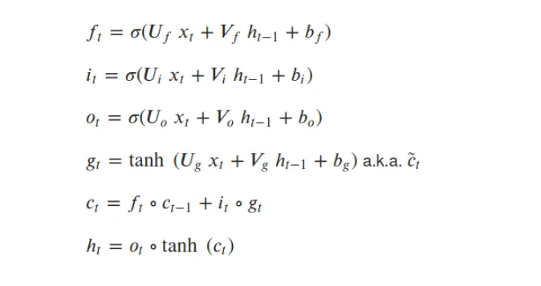

### LSTM (Long Short-Term Memory) from Scratch Using Python
In this project, I implement LSTM (Long Short-Term Memory) from scratch using Python, PyTorch, and NumPy.

### Overview
LSTM is a crucial algorithm in deep learning, widely used in various fields such as computer vision and natural language processing (NLP), including tasks like question answering, machine translation, and more.
### LSTM ARCHIITACTURE 

