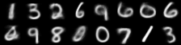
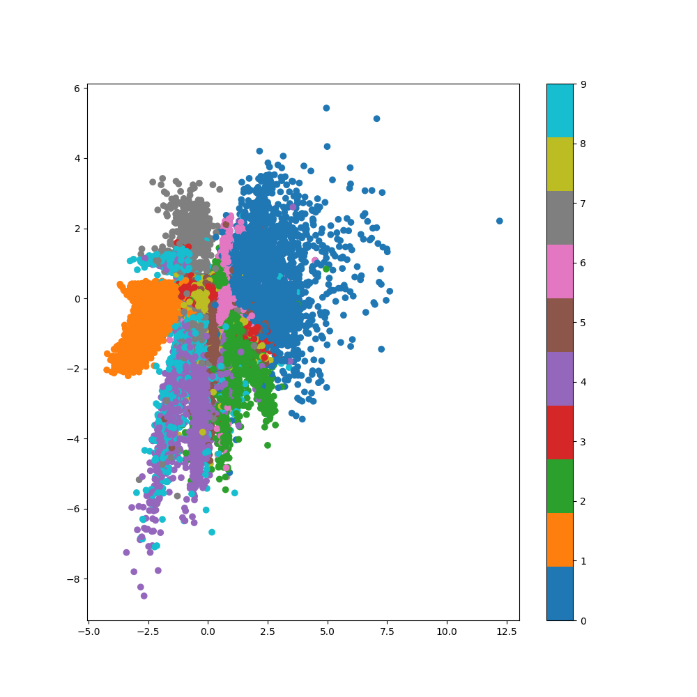
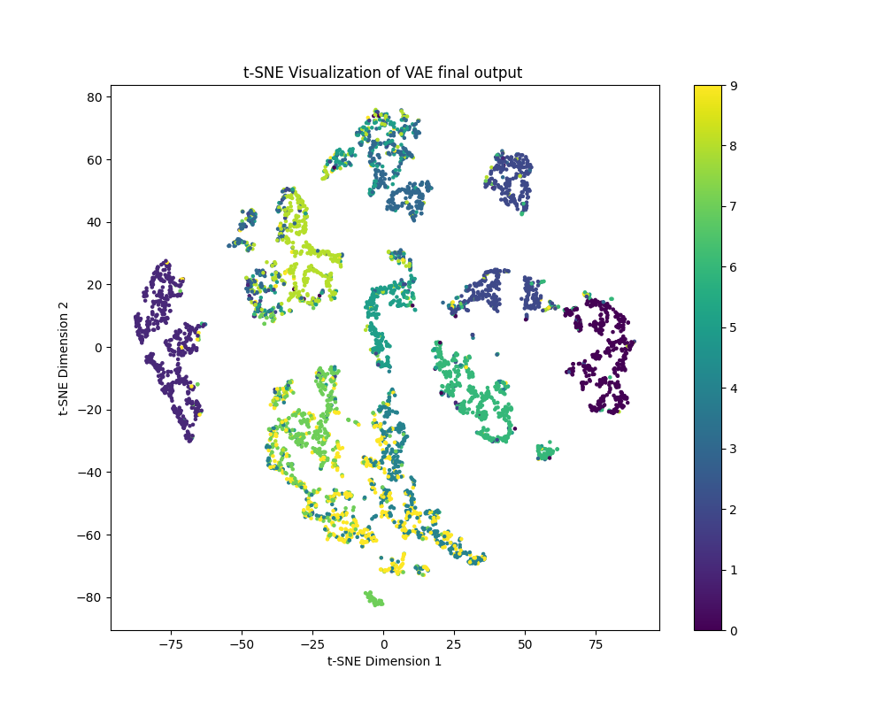

# Variational Autoencoder (VAE) on MNIST

This project implements a **Variational Autoencoder (VAE)** from scratch using PyTorch on the MNIST dataset. The VAE is trained to learn a probabilistic latent space (Z) representation of the data, allowing for image reconstruction and generation of new images.

## Table of Contents
- [Variational Autoencoder (VAE) on MNIST](#variational-autoencoder-vae-on-mnist)
  - [Table of Contents](#table-of-contents)
  - [Overview](#overview)
  - [Architecture](#architecture)
    - [Loss Function](#loss-function)
  - [Dataset](#dataset)
  - [Training](#training)
  - [Results](#results)
  - [How to Run](#how-to-run)
    - [Clone the repository:](#clone-the-repository)

## Overview

A Variational Autoencoder (VAE) is a type of generative model that learns a latent space distribution for input data. Unlike standard autoencoders, a VAE imposes a probabilistic structure on the latent space, allowing the generation of new data points by sampling from this learned distribution.

This implementation trains a VAE on the MNIST dataset of handwritten digits, enabling the model to:
1. Reconstruct images from the test set.
2. Generate new digits by sampling from the learned latent space.
3. Visualize the latent space using t-SNE.

## Architecture

The VAE model architecture consists of:
- **Encoder**: Compresses the input data into a latent space distribution (mean and variance).
- **Latent Space**: Samples latent variables from the learned distribution.
- **Decoder**: Reconstructs the original data from the latent space.


### Loss Function
The loss function is composed of two terms:
1. **Reconstruction Loss**: Measures the similarity between the input and reconstructed output (Binary Cross Entropy).
2. **KL Divergence**: Measures how much the learned latent space deviates from a unit Gaussian distribution.

The total loss is the sum of these two components.

## Dataset

The project uses the **MNIST** dataset, a grayscale images of handwritten digits (0-9), each with a resolution of 28x28 pixels.


The dataset is loaded using PyTorch's `torchvision.datasets` and `torch.utils.data.DataLoader`.

## Training

The VAE is trained for a configurable number of epochs (default 60) using the AdamW optimizer.

Key training parameters:
- Learning Rate: `1e-3`
- Weight Decay: `1e-2`
- Latent Dimension: `2`
- Hidden Dimension: `512`
- Batch Size: `64`
- Optimizer: AdamW


## Results

After training the model, the following results can be visualized:
1. **Reconstructed Images**: Visualize how well the VAE reconstructs input images from the test set.

1. **Latent Space Visualization**: how the VAE clusters different digit classes.

1. **Generated Images**: New images can be generated by sampling from the learned latent space.



## How to Run

### Clone the repository:
```bash
git clone https://github.com/aymen-000/DEEP_LEARNING_ALGORITHMS
cd DEEP_LEARNING_ALGORITHM/VAE
pip install -r requirements.txt
python main.py --num_epochs 60 --batch_size 64 --lr 1e-3
tensorboard --logdir=/runs 
```


